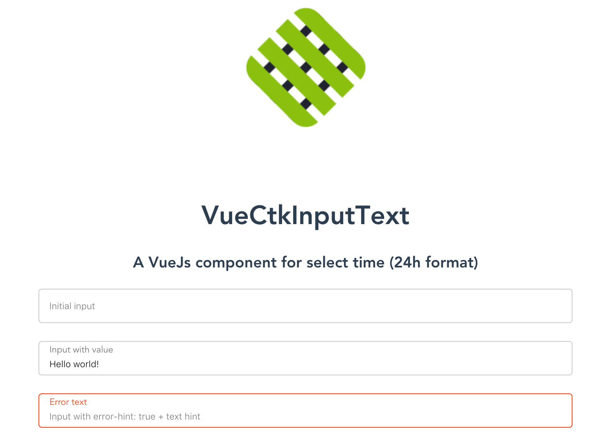

# vue-ctk-date-time-picker

> A vue component for select dates (range mode available) & time



## Demo
[Enjoy here](https://htmlpreview.github.io/?https://github.com/chronotruck/vue-ctk-input-text/blob/master/demo/index.html)

## Installation

### Using yarn

`yarn add vue-ctk-date-input-text`

### Using npm

`npm i --save vue-ctk-date-input-text`

## Usage

### ES6 Modules / CommonJS

```js
import VueCtkDateTimePicker from 'vue-ctk-date-time-picker';
import 'vue-ctk-date-time-picker/dist/vue-ctk-date-time-picker.min.css';

Vue.component('vue-ctk-date-input-text', VueCtkInputText);
```

```html
<vue-ctk-input-text></vue-ctk-input-text>
```

### UMD

```html
<vue-ctk-input-text></vue-ctk-input-text>

<script src="https://unpkg.com/vue" charset="utf-8"></script>
<script src="./dist/umd/vue-ctk-input-text.min.js" charset="utf-8"></script>
<link rel="stylesheet" type="text/css" href="./dist/umd/vue-ctk-input-text.min.css">

<script type="text/javascript">
  Vue.component('vue-ctk-input-text', window.VueCtkInputText.default);
</script>
```
## Props API

| Props      | Type       | Required | Default    | Options        |
|------------|------------|----------|------------|----------------|
| v-model    | String/Int | true     | -          | -              |
| label      | String     | false    | Enter Text | -              |
| type       | String     | no       | text       | text or number |
| hint*       | text       | no       | -          |                |
| error-hint** | Boolean    | no       | false      |                |

## Contribution

``` bash
# install dependencies
npm install

# serve with hot reload at localhost:8080
npm run dev
```

## Build

Build configuration is located in the `poi.config.js` file, to build just run: `npm run build`, it will build to `cjs` and `umd` directories.

## Tests

This template uses karma with chai by default, you can change test settings in poi.config.js

`npm run test`
`npm run test:watch`
`npm run test:cov`

## License

This project is licensed under [MIT License](http://en.wikipedia.org/wiki/MIT_License)

